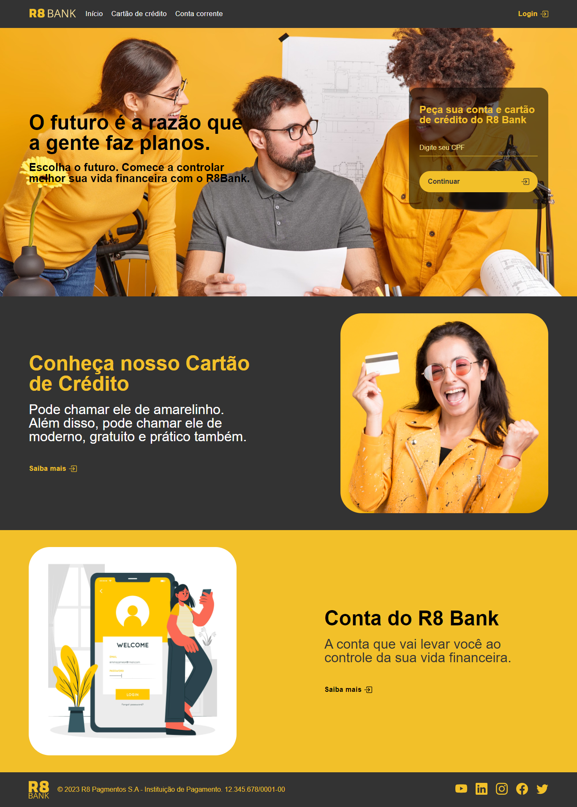
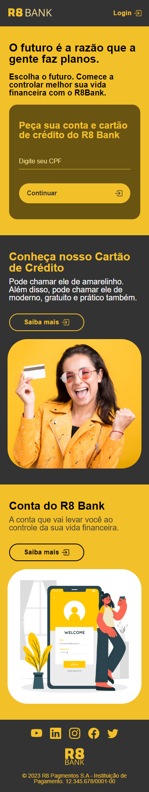

<h1 align="center" id="top">R8 Bank</h1>

<h2>Sobre o desafio</h2>

  O desafio era usar de referência o layout LP do Nubank e fazer um clone mudando a identidade visual.

<h2>Tecnologias e ferramentas</h2>

Tecnologias:
* HTML
* CSS

Ferramentas e libs:
* Figma
* Bootstrap icons

<h2>Novas técnicas aplicadas no projeto</h2>

* Mobile First
* Estilização de scroll lateral no Desktop e velocidade de scroll nos links âncora dentro da página
* Inserção de svg através de Bootstrap Icons

 
<h2>Links</h2>

* <a href="https://nubank.com.br/" target="_blank">Página de referência</a>
* <a href="https://vast-reason.surge.sh/" target="_blank">Visualizar o projeto</a>

<h2>Versão para Desktop</h2>
 

<h2>Versão Mobile</h2>

